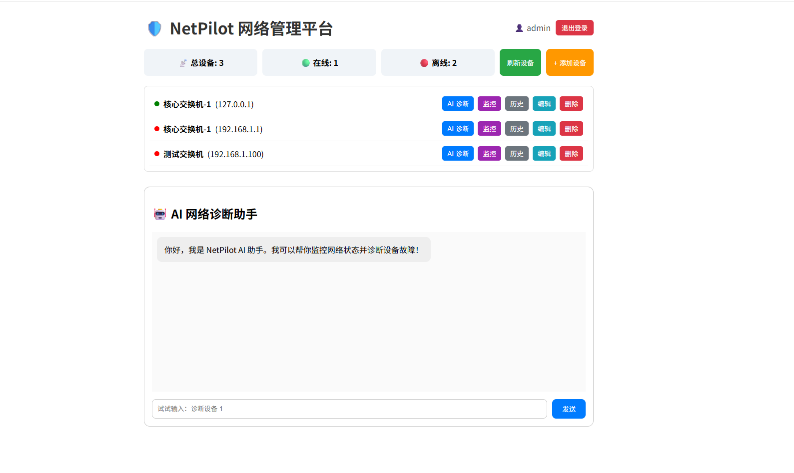
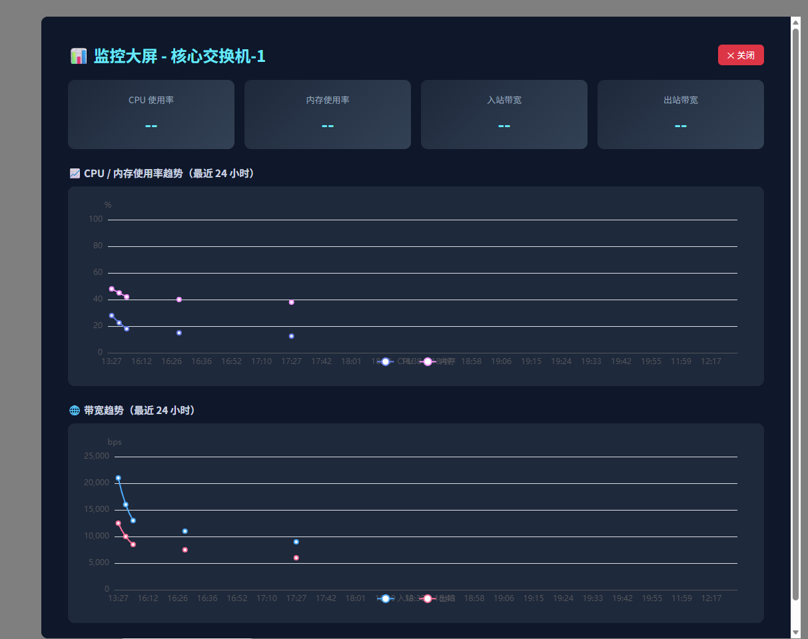
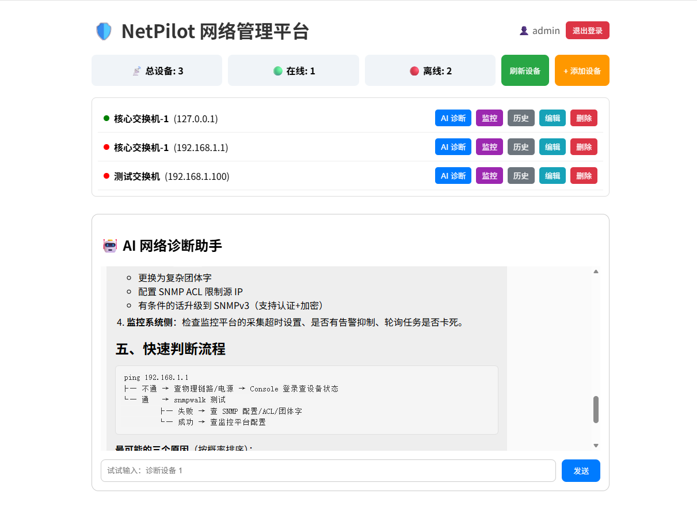

# NetPilot 智能网络管理平台（前端）

NetPilot 的前端界面，基于 Vue 3 + Vite + ECharts 构建。

## 🛠 技术栈

- Vue 3 / Vite
- Axios（请求拦截器自动带 JWT）
- ECharts（监控大屏）
- marked（AI 回复的 Markdown 渲染）

## ✨ 主要界面

- **登录 / 注册**：JWT Token 自动存储和注入
- **设备管理**：设备列表 + 在线状态 + 增删改查
- **AI 助手**：流式对话、打字机效果、Markdown 渲染
- **AI 诊断**：一键生成设备诊断报告，支持历史查询
- **监控大屏**：CPU / 内存 / 带宽趋势可视化，深色主题

## 🚀 快速开始

```bash
npm install
npm run dev
```

前端访问：http://localhost:5173
后端默认地址：http://localhost:8080/api

## 🔗 后端仓库

[netpilot-backend](https://github.com/tzx04/netpilot-backend)

## 📷 项目截图

### 首页 - 设备管理与 AI 助手


### 监控大屏 - CPU/内存/带宽趋势


### AI 智能诊断报告

